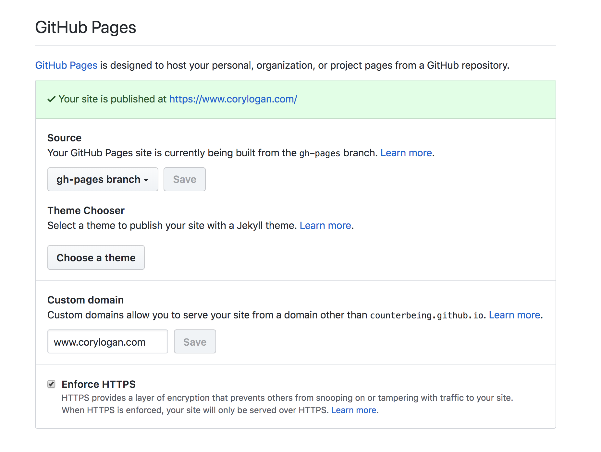

+++
date = 2018-07-12T11:56:11-07:00
title = "Github Pages With Apex Domain"
description = "www and apex domains pointing to github pages"
published = true
type = "post"

[[resources]]
  src = "images/github-pages-control-panel.png"
  name = "Github Pages Control Panel"
+++

### Saving time and money with GitHub Pages

I know that [GitHub Pages](https://pages.github.com/) are nothing new, but I only recently realized how versatile they are. You can host any static content you want there for free, and I’ve recently started using it for my blogs. Major benefits of using GitHub Pages as I see it:

- Free hosting for simple pages
- Deployment is as easy as a git push
- SSL certs are a one time checkbox
- It handles redirecting to the `www` subdomain, or to the apex domain without no real configuration

### My default configuration

You just have to set up the DNS.

1. Create a CNAME record from your `www` subdomain to `your-username.github.io`
2. Create an A record to each of the following from your apex domains
  - 185.199.108.153
  - 185.199.109.153
  - 185.199.110.153
  - 185.199.111.153
3. Once your DNS has propagated, visit the settings on your repo, add either your www or apex domain as your custom domain:

4. Once GitHub has gotten a cert from LetsEncrypt, the option to enforce HTTPS will be available to you.
5. Now all you have to do is set up an `index.html` file on the `gh-pages` branch (if you selected that option), or on the master in the docs folder (if you chose this route). This will probably depend on how you choose to build your site, what’s convenient.

I use a build server that builds all of my blogs as static sites, and then adds them to my `gh-pages` branch and pushes to git after I make any change to any of them, that’s beyond the scope of this article, but it’s something to think about.

GitHub pages seem perfect for small businesses, personal blogs, or software docs. More complete documentation can be found [on GitHub](https://help.github.com/articles/setting-up-an-apex-domain/). These are just the settings I generally go with, as I think they’re great defaults.
